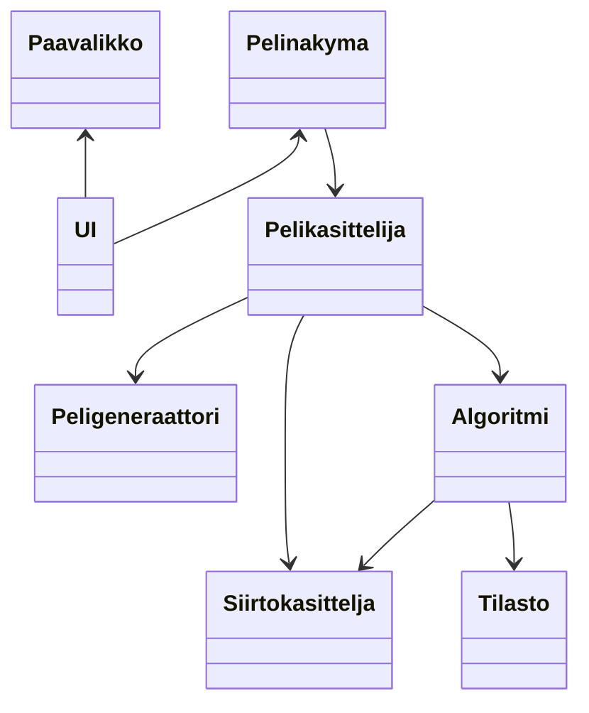
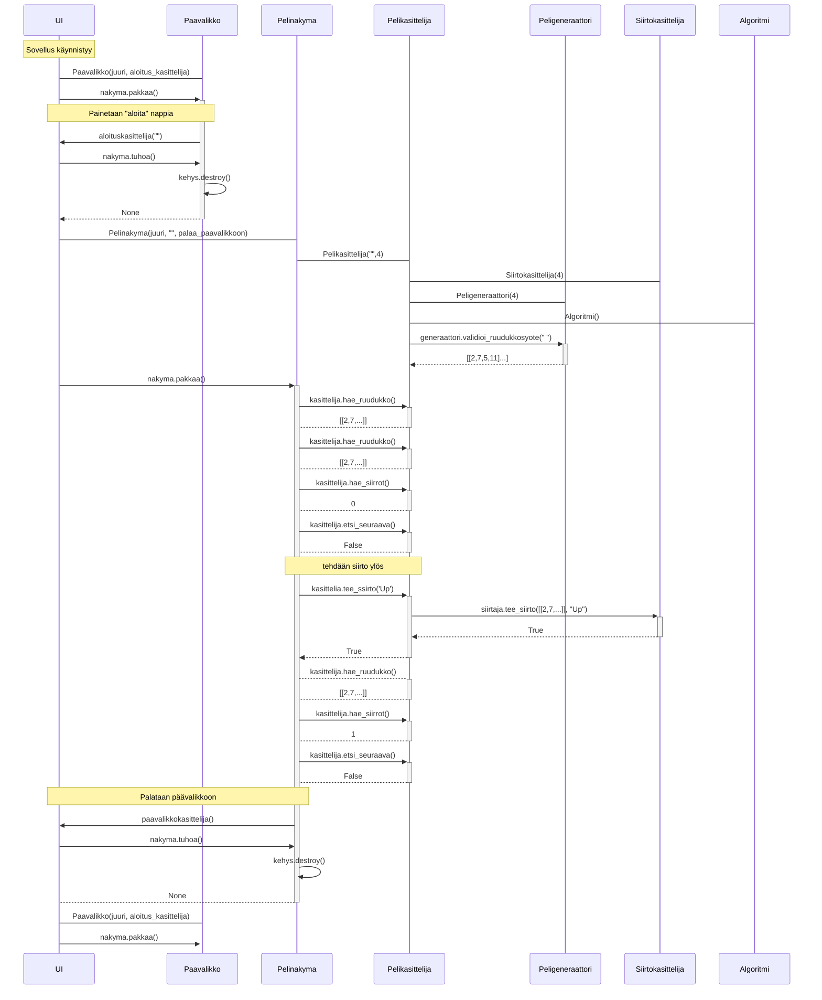
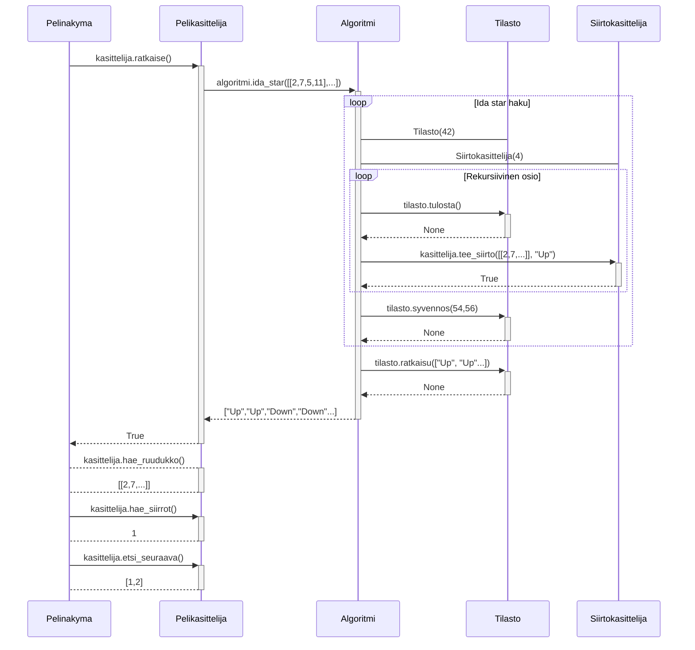
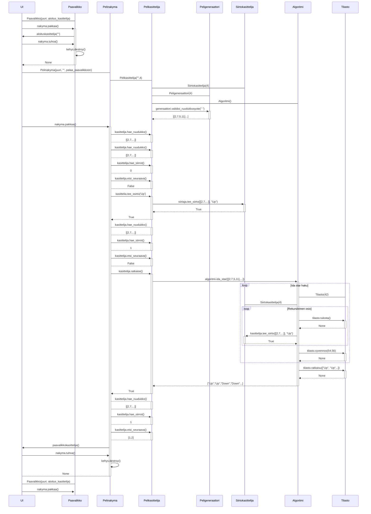

# Toteutusdokumentti 

## Luokkakuvaus

## Sekvenssikaaviot
Sekvenssikaavio missä käyttäjä käynnistää pelin tyhjällä syötteellä, tekee yhden siirron ja palaa päävalikkoon.  
Nuolettomat yhteydet kuvaavat luokan luomista.

Sekvenssikaavio ratkaisualgoritmin toteutuksesta

Edelliset kaaviot yhdessä

## Tila- ja aikavaativuus

Ratkaisualgoritmin aikavaatimus on O(n^k), missä k on haun syvennyksien määrä.  
Aikavaativuutta on tarkemmin vaikea arvioida heurestiikan ja hakupuussa tehdyn karsinnan seurauksena.  
Seuraava osio antaa esimerkkejä tapauksista joiden ratkaisu on huomattavasti nopeampi, vaikka syvennöksiä tehdään enemmän.

Ratkaisualgoritmin tilavaatimus on suhteessa mitätön. Haun aikana aikaisempia tiloja ei talleneta lainkaan, eli käytetty tila ei kasva haun aikana.  
Haku tallentaa ainoastaan aiemmat siirrot (lista jonka pituus ei voi olla yli 80 joka on kauin mahdollinen syvyys), sekä haun lähtökohta.

## Suorituskyky
Seuraavassa taulukossa on muutama satunnaisesti generoitu peli, ja suorituksen aikana tullutta dataa.  
Ensimmäisessä sarakkessa on pelin syöte, ja lopuissa on haun syvennöksen numero, ja syvennökseen mennessä luotujen solmujen määrä.

| Testattu ruudukko                     |   1   |   2   |   3   |   4   |   5   |   6       |   7       |
|---------------------------------------|-------|-------|-------|-------|-------|-----------|-----------|
| 5,9,2,3,0,8,4,14,10,12,11,1,15,7,13,6 | 5     | 38    | 815   | 7812  | 58349 | 398316    | 2552940   |   
| 6,13,7,2,10,4,8,11,12,15,1,14,9,5,0,2 | 4     | 57    | 623   | 4038  | 25388 | 158308    | 970967    |
| 10,9,5,12,2,4,7,8,6,14,11,1,13,15,0,3 | 11    | 101   | 823   | 5676  | 33558 | 188420    | 999663    |
| 4,12,2,3,5,6,7,15,0,8,1,11,10,14,9,13 | 5     | 43    | 221   | 1330  | 7954  | 48560     | 298406    |
| 13,4,12,9,15,1,6,2,8,10,7,14,5,11,0,3 | 7     | 46    | 508   | 4430  | 34366 | 254685    | 1802658   |

### Logaritminen esitys edellisestä datasta

Kaaviosta huomaa että eksponentiaalisen kasvun määrä vaihtelee ruudukustosta riippuen. 

Seuraavassa taulukossa on samat syötteet, mutta myös ratkaisun muuta tietoa, kuten saadun ratkaisun pituus ja haussa tehtyjen syvennöksien määrä.
Huomioi että haun kesto vaihtelee käytetyn laitteiston mukaan.

| Testattu ruudukko                     | Kesto(s)  | Solmut    | Syvennökset   | Ratkaisun pituus  |
|---------------------------------------|-----------|-----------|---------------|-------------------|
| 5,9,2,3,0,8,4,14,10,12,11,1,15,7,13,6 | 41.065    | 2921787   | 7             | 51                |
| 6,13,7,2,10,4,8,11,12,15,1,14,9,5,0,2 | 14.075    | 1039328   | 7             | 51                |
| 10,9,5,12,2,4,7,8,6,14,11,1,13,15,0,3 | 103.134   | 10002121  | 8             | 47                |
| 4,12,2,3,5,6,7,15,0,8,1,11,10,14,9,13 | 19.123    | 1898836   | 8             | 50                |
| 13,4,12,9,15,1,6,2,8,10,7,14,5,11,0,3 | 34.029    | 3426445   | 7             | 55                |

## Työn puutteet ja parannusehdotukset
- Luokkien riippuvuudet tekevät koodin muokkaamisesta monimutkaista ja hidastaisi jatkokehitystä.
- Projekti on ohjelmoitu Python-kielellä joka on tunnetusti hitaasti suoriutuva
- Algoritmin tehokkuutta voisi parantaa:
    - Vaihtaa käytettyjä datatyyppejä ja selvittää milloin kirjasto, lista, tupla tai jokin muu olisi nopeampi
    - Heurestiikkaa voi parantaa, tunnettuja parempia heurestiikkoja esimerkiksi "pattern database"-heurestiikat voivat olla projektissa käytettyä Walking Distance heurestiikkaa tehokkaampia.  
    Kyseiset heurestiikat kuitenkin nimensäkin mukaan käyttävät tietokantoja, joka nostaisi sovelluksen tilavaativuutta
    - Hakupuuta voisi karsia siten, että IDA* haku kävisi vähemmän aikaisempia tiloja läpi, tämäkin usein lisäisi tilavaativuutta
- Sovellus hyväksyy vain 4x4 ruudukot, sovellusta voisi laajentaa hyväksymään pienemmät ja suuremmat ruudukkokoot. Tämä on mahdollista jo suuressa osassa sovellusta ja kovakoodattuna vain käyttöliittymään

## Lähteet

- Tiralabra-kurssimateriaali ja esimerkkiprojektit
- Ohjelmistotekniikka 2023
- https://michael.kim/blog/puzzle
-  https://www.youtube.com/watch?v=g0phuZDM6Mg
- http://kociemba.org/themen/fifteen/fifteensolver.html (vain nettisivu)
-  https://en.wikipedia.org/wiki/Iterative_deepening_A*
- https://www.geeksforgeeks.org/check-instance-15-puzzle-solvable/
